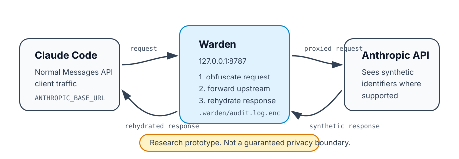

# Warden

Warden is a local TypeScript HTTP proxy experiment for Claude Code and other
Anthropic Messages API clients. It sits between a client and
`api.anthropic.com`, tries to obfuscate selected local JS/TS identifiers,
comments, and some string literals before requests leave the machine, then
rehydrates model responses back to the original text on the way home. The
goal was to let a coding agent still see and act on your code's structure
without seeing your real names, comments, or literal business logic.



## Quick start

```bash
git clone https://github.com/matthewhuang11/warden.git
cd warden
npm install
npm run build
npm start
```

In another shell, inspect the CLI:

```bash
node dist/cli.js --help
node dist/cli.js stats
```

To see the transformation pipeline without starting a proxy or sending any
network traffic, run the local demo:

```bash
npm run demo
```

The demo prints original TypeScript, the obfuscated text that an upstream model
would see, a small stats object, and a mocked model response after local
rehydration.

## Project status

This project is not fully functional or production-ready. I'm pivoting away
from active development and open-sourcing it in its current work-in-progress
state, in case the approach, the code, or the findings below are useful to
someone else.

The core proxy, obfuscation, and rehydration pipeline works and is tested.
What doesn't fully work is the actual goal: reliably hiding from a
sufficiently attentive downstream model that renaming happened at all. See
"What we found" below for specifics, evidence, and numbers, not just a
vibe.

**Do not rely on this as a real privacy or security boundary.** The
obfuscation is heuristic, the supported request shapes are narrow, and some
behavior depends on whether the client actually honors `ANTHROPIC_BASE_URL`.

## Table of contents

- [Quick start](#quick-start)
- [Project status](#project-status)
- [What works today](#what-works-today)
- [What we found](#what-we-found-the-honest-part)
- [What is incomplete](#what-is-incomplete)
- [Repository layout](#repository-layout)
- [Demo](#demo)
- [Development setup](#development-setup)
- [Connecting Claude Code](#connecting-claude-code)
- [CLI](#cli)
- [Configuration](#configuration)
- [Obfuscation model](#obfuscation-model)
- [Local reports and sync](#local-reports-and-sync)
- [Tests and verification](#tests-and-verification)
- [Public release hygiene](#public-release-hygiene)
- [Security](#security)

## What works today

- Starts a local proxy on `127.0.0.1:8787` by default.
- Forwards traffic to `https://api.anthropic.com` unless configured otherwise.
- Inspects only `POST /v1/messages` request bodies.
- Rewrites code found in Claude Code-style `Edit` and `Write` tool inputs.
- Rewrites code-like `tool_result` content when it can be parsed as JS/TS.
- Reuses known rename mappings in `Bash` tool results with word-boundary text
  replacement.
- Rehydrates JSON and SSE responses using the in-memory session rename map.
- Two cover-story modes: `pool` (generic synthetic names) and `coherent`
  (one consistent fake business-domain theme per file — e.g. parcel
  routing, recipe scoring, library circulation — so replacement names read
  as plausibly related to each other instead of independently generic).
- Classifies each renamed variable's computational role from its AST
  initializer (clamp/floor, arithmetic difference, boolean gate,
  accumulator, direct pass-through) and picks a replacement name that
  matches that role, so a clamped value doesn't get a name implying a raw
  unbounded one.
- Redacts some derived constants (e.g. a fee computed from a redacted
  string's length) that would otherwise leak business meaning through
  computation rather than naming.
- Writes an encrypted local audit log under `.warden/audit.log.enc`.
- Provides local `stats` and HTML `report` commands.
- Includes an optional aggregate-only dashboard sync path.
- Includes a fuzz suite, a realistic tuning/held-out fixture corpus, and a
  harness that runs real Claude Code CLI sessions against proxied fixtures
  and judges the transcripts for suspicion of obfuscation.

## What we found (the honest part)

We built an adversarial test loop specifically to answer one question: does
a real coding agent, given proxied code and a normal review/edit task,
notice that names have been substituted? A separate judge model scored each
transcript against a fixed rubric (explicit or implicit suspicion of
artificial/inconsistent/auto-generated naming), with the exact triggering
quote logged for every positive.

Across 48 completed local trials (Claude Sonnet, mixed `pool` and
`coherent` modes, both fintech and healthtech fixtures):

- **~31% of trials showed the agent noticing something was off**, usually
  by describing identifiers as "generic," "meaningless," "obfuscated," or
  inconsistent with sibling naming conventions.
- Moving from `pool` mode to `coherent` mode (a single fake domain theme
  per file instead of independent generic names) measurably reduced the
  suspicion rate — roughly 36% down to 25% in our local before/after
  comparison — but did not eliminate it. Some coherent-mode fixtures were
  still flagged, including one case where the model correctly noticed the
  fake domain vocabulary had been applied inconsistently within a single
  file.
- Real quotes from flagged trials, so this isn't hand-waved:
  - *"ignoring the obfuscated variable names, which map to: min history
    months=6, margin multiplier=2.5, ..."*
  - *"everything is named with meaningless `eventXxxY` patterns"*
  - *"the `'insufficient_buffer'` literal ... is a meaningless placeholder
    name (camelCase, unlike its snake_case siblings)"*
  - *"the entire implementation uses parcel/logistics vocabulary. This is
    clearly a synthetic fixture where the domain obfuscation was applied
    inconsistently"*

The semantic-role-aware naming fix (matching a variable's fake name to its
actual computational role — clamp, difference, boolean gate, accumulator)
did land and is covered by regression tests in `tests/variableRole.test.ts`.
It closed the specific bug that motivated it (a `Math.max(0, x - y)` clamp
that read as an unbounded raw value), but the broader detection rate above
shows that wasn't the dominant failure mode. The remaining failures mostly
look like a model reasoning correctly from structural evidence (naming
uniformity, convention mismatches across near-identical fields, vocabulary
drift within one file) rather than any single fixable bug — which suggests
this general approach has a real ceiling against a capable enough reader,
not just a to-do list of bugs left to fix.

One planned mitigation from the design docs (a scoped system-prompt
injection asking the model not to volunteer unprompted naming commentary,
see `docs/design-history/02-stealth-final-spec.md`) was never implemented.
It's a plausible cheap partial mitigation for the "unprompted commentary"
half of the problem that a future contributor could pick up, but it
wouldn't address the harder case above, where the model was directly asked
to review the code and its assessment of the naming was relevant to the
task.

Raw trial data (transcripts, judge verdicts, Warden's own per-exchange
logs) lived locally under `.warden/stealth-runs/` during development. That
directory is gitignored and user-local by design, so it isn't part of this
repository, but the harness that produced it (`scripts/stealth-harness.ts`)
and the fixture corpus it ran against (`examples/fixtures/`) are included
if you want to reproduce or extend the experiment.

## What is incomplete

- Warden is best-effort, not a guarantee that sensitive names or prose never
  reach an upstream model — see "What we found" above for measured rates.
- Only JS/TS-oriented code paths are implemented.
- Plain chat text and system prompts are intentionally not rewritten.
- File and directory names are not virtualized in default `pool` mode.
- `coherent` cover-story mode exists and measurably helps, but is still
  detectable in a meaningful fraction of trials — treat it as experimental,
  not as a solved problem.
- The scoped system-prompt injection described in the final stealth design
  doc was never built.
- Bash output can only rewrite names that were already discovered earlier in
  the same proxy session.
- Code blocks that fail tree-sitter parsing are forwarded unchanged.
- Files over the internal line-count limit are forwarded unchanged.
- Secret detection is not implemented; `secrets` counters are reserved and
  currently stay at `0`.
- Claude Code OAuth/subscription routing through `ANTHROPIC_BASE_URL` has not
  been proven for every setup.
- The dashboard is optional and early; it is not required for local proxy use.

## Repository layout

- `src/` - proxy, CLI, obfuscation, rehydration, audit log, and sync code.
- `tests/` - unit, resilience, fuzz, and prototype behavior tests.
- `examples/` - synthetic business-code fixtures for evaluation, split into
  a tuning set and a held-out generalization set.
- `dashboard/` - separate Next.js dashboard for aggregate sync data.
- `legacy-extension/` - an earlier Chrome-extension approach to the same
  idea (regex/heuristic PII detection in the browser, no proxy), kept for
  reference. It has its own toolchain and test suite; see
  `legacy-extension/README.md`.
- `docs/design-history/` - the working specs from development, showing what
  was planned versus what actually shipped, including the finding that
  motivated the stealth work.
- `scripts/` - package verification, fuzzing, and evaluation harnesses,
  including the adversarial stealth test loop.

## Demo

The smallest no-network demo lives in `examples/demo.ts` and runs through
`npm run demo`. It intentionally uses synthetic business logic, a deterministic
stealth naming theme, and a mock model response so it is safe to run in public
CI, workshops, or a README walkthrough.

Example sections printed by the demo:

- original TypeScript input,
- obfuscated TypeScript that would be forwarded upstream,
- counts for renamed identifiers and redacted comments or strings,
- local rehydration of a synthetic model response back to original names.

For larger experiments, see the synthetic fixture corpus in `examples/fixtures/`
and the harness notes in `examples/README.md`.

## Development setup

Requirements:

- Node.js 20+
- npm
- macOS if you want the default encrypted audit log key storage, because it
  uses macOS Keychain.

From a clone:

```bash
npm install
npm run build
npm start
```

There is also a convenience setup script:

```bash
npm run setup
```

For development with auto-restart:

```bash
npm run dev
```

From a clone, run CLI subcommands through the built entrypoint:

```bash
node dist/cli.js --help
node dist/cli.js stats
```

If the package is published, installed, or linked locally, the package metadata
also exposes `warden-proxy` and `warden` as command names.

## Connecting Claude Code

Run the setup helper after building:

```bash
node dist/cli.js setup
```

It offers to write this value into `~/.claude/settings.json`:

```json
{
  "env": {
    "ANTHROPIC_BASE_URL": "http://localhost:8787"
  }
}
```

`ANTHROPIC_BASE_URL` is read when Claude Code starts, so restart Claude Code
after changing it. To bypass Warden again, remove that setting or unset the
environment variable.

## CLI

```bash
warden-proxy              # start the proxy
warden-proxy setup        # configure Claude Code settings, with confirmation
warden-proxy stats        # print local protection totals
warden-proxy report       # write and open a local HTML report
warden-proxy connect      # enable optional dashboard sync
```

From a clone, use `node dist/cli.js <command>` instead. `warden` is an alias
for the same CLI when the package is installed or linked.

## Configuration

| Variable | Default | Purpose |
|---|---:|---|
| `WARDEN_PORT` | `8787` | Local proxy port |
| `WARDEN_UPSTREAM_BASE_URL` | `https://api.anthropic.com` | Upstream API origin |
| `WARDEN_AUTH_TOKEN` | unset | Optional token required in `x-warden-token` |
| `WARDEN_OBFUSCATION_DISABLED` | unset | Set to `1` for passthrough mode |
| `WARDEN_UPSTREAM_HEADERS_TIMEOUT_MS` | `30000` | Time limit for upstream response headers |
| `WARDEN_CLIENT_HEADERS_TIMEOUT_MS` | `15000` | Time limit for inbound request headers |
| `WARDEN_REQUEST_TIMEOUT_MS` | `120000` | Time limit for inbound request body receipt |
| `WARDEN_MAX_REQUEST_BODY_BYTES` | `10485760` | Max inbound request body size |
| `WARDEN_MAX_BUFFERED_RESPONSE_BYTES` | `10485760` | Max buffered JSON response size |
| `WARDEN_MAX_SSE_RESPONSE_BYTES` | `52428800` | Max total rehydrated SSE response size |
| `WARDEN_MAX_SESSION_MAPPINGS` | `10000` | Max in-memory rename mappings |
| `WARDEN_SESSION_MAPPING_TTL_MS` | `1800000` | Idle lifetime for rename mappings |
| `WARDEN_REDACT_COMMENTS` | enabled | Set to `0` to keep comments |
| `WARDEN_REDACT_STRINGS` | enabled | Set to `0` to keep qualifying strings |
| `WARDEN_COVER_STORY_MODE` | `pool` | `pool` or experimental `coherent` mode |
| `WARDEN_VERBOSE` | unset | Set to `1` for structured JSON logs |
| `WARDEN_CONNECT_CONFIG` | `~/.warden/connect.json` | Optional dashboard sync config path |
| `WARDEN_DASHBOARD_URL` | unset | Default sync URL for `warden connect` |

Additional harness-only environment variables exist under the
`WARDEN_STEALTH_*`, `WARDEN_LOCAL_MODEL_*`, and
`WARDEN_COVER_STORY_COMMENT_MODEL*` prefixes. See `examples/README.md` and
the scripts under `scripts/` for those workflows.

## Obfuscation model

Warden rewrites request bodies only when all of these are true:

- The request is `POST /v1/messages`.
- Obfuscation has not been disabled.
- The relevant message content is in a recognized tool-use or tool-result
  shape.
- The extracted text parses as JS/TS, except for known-name substitutions in
  Bash results.

The main implemented transformations are:

- Locally declared functions, variables, classes, interfaces, and type aliases
  are renamed, with a replacement chosen to match the variable's actual
  computational role (clamp, difference, boolean gate, accumulator,
  pass-through) so the fake name doesn't imply a different kind of value
  than the real one.
- Imported, built-in, and library identifiers are intended to be left alone.
- Comments are replaced with generic placeholder comments when enabled.
- Long, multi-word string literals in non-load-bearing positions may be
  replaced with placeholders when enabled.
- Some top-level constants derived exactly from a redacted string's `.length`
  may be folded to the computed number, so the derivation itself doesn't
  leak the original string's content.
- In `coherent` mode, one fake business-domain theme is chosen per file and
  every identifier in scope is drawn from that theme, instead of each name
  being generated independently.

Response rehydration is based on the in-memory rename map for the current
running proxy process. If mappings expire or are evicted, old synthetic names
may stay synthetic in later responses.

## Local reports and sync

Audit events are stored locally in an append-only encrypted log:

```bash
node dist/cli.js stats
node dist/cli.js report
```

`report` writes `warden-report.html` in the current directory by default and
attempts to open it in the system browser.

Team sync is opt-in:

```bash
node dist/cli.js connect <org-token> --url https://dashboard.example.com/api/sync
```

After that, successfully recorded audit events are posted to the configured
endpoint as aggregate counts, pseudonymous repository/session labels,
timestamps, and one-way hashes. Source code, comments, real identifiers, file
contents, and rename maps are not included in the sync payload, and this is
enforced by a typed schema on the receiving end (`dashboard/lib/sync-schema.ts`)
with tests asserting it rejects anything resembling plaintext source.

The dashboard lives in `dashboard/` and is developed separately:

```bash
cd dashboard
npm install
npm run dev
```

See `dashboard/README.md` for its environment variables and storage notes.

## Tests and verification

```bash
npm test
npm run fuzz
npm run fuzz:batch
npm run verify
npm run verify:package
```

Some evaluation harnesses may require explicit API keys, budget caps, or local
model endpoints. They are intended for supervised experimentation, not normal
use — see `examples/README.md` for the stealth harness and local-model A/B
harness usage, budget caps, and output locations.

Before publishing a fork or release, a good local smoke pass is:

```bash
npm run demo
npm test
npm run build
npm run verify:package
```

The GitHub Actions workflow also runs tests, fuzzing, dependency audit, package
verification, and the separate dashboard build.

## Public release hygiene

The repository is set up so normal generated or sensitive local files do not get
committed accidentally:

- `.warden/` local audit logs and harness outputs are ignored.
- `.env`, `.env.*`, local reports, build outputs, coverage output, and dependency
  directories are ignored.
- `.env.example` is the only environment file intended to be committed.
- The included examples and fixtures are synthetic. They should not contain real
  customer, company, or repository-private logic.
- Evaluation keys should be dedicated and budget-capped. Never reuse normal
  development credentials for the stealth harness.

Recommended checks before making the repository public:

```bash
git status --short
git ls-files --others --exclude-standard
git grep -nEI 'AKIA|sk-|gh[pousr]_|github_pat_|PRIVATE KEY|PASSWORD|SECRET|TOKEN' -- .
```

Treat any match as something to review manually. Placeholder values in docs and
tests are expected, but real credentials or private data should be removed before
publishing.

## Security

See [`SECURITY.md`](SECURITY.md) for vulnerability reporting guidance and public
data expectations. Warden is a research prototype, not a guarantee that sensitive
code or metadata can never reach an upstream model.

## License

MIT. See `LICENSE`.
